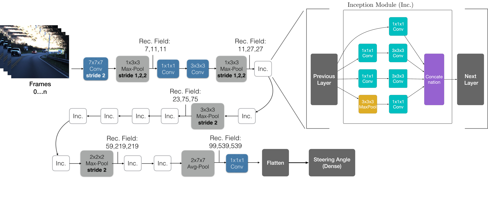

# Behavioral Cloning Research

# Introduction

In 1989, ALVINN, the self-driving car (truck) made by Dr. Dean Pomerleau and his team, drove around the Carnegie Mellon campus. According to Pomerleau, The vehicle was powered by a CPU slower than the Apple Watch. The car used a fully connected neural network to predict the steering angle of the car in real time. Fast forward twenty years, NVIDIA proposed a novel method that combines Pomerleau's idea with the modern GPU, giving NVIDIA's car the capability to accurately perform real-time end to end steering prediction. Around the same time, Udacity held a challenge that asked researchers to create the best end to end steering prediction model. This project is deeply inspired by that competition, and the goal is to further the work in behavioral cloning for self-driving vehicles. 

# I3D Model Architecture

## Motives

NVIDIA's paper used a convolutional neural network with a single frame input. I believe that, even though this architecture yielded good results, the single frame CNN doesn't provide any temporal information which is critical in self-driving. This is the motive behind choosing the i3d architecture, which is rich in spacial-temporal information.

<!--In fact, the winner of the Udacity challenge (team komanda) deployed a Convolutional LSTM architecture originally used for video classification and weather forecasting. -->

## Model

The input of the network is a 3d convolutional block, with the shape of `n * weight * height * 3`. `n` is the length of the input sequence. Furthermore, the network also uses nine inception modules. The output layers are modified to accommodate for this regression problem. A flatten layer and a dense layer are added to the back of the network. 

## Results

During training, RMSE (root mean squared error) is used for the loss function. Udacity's open source driving dataset is used for training and testing. RMSE is also the benchmark for the validation results. For the results of the Udacity challenge, please click [here](https://github.com/udacity/self-driving-car/tree/master/challenges/challenge-2). 

| Model Type  				| Parameters   | Training Loss| Validation Score|
| ------------------		|:------------:| ------------:| ---------------:|
| Single Frame ConvNet 		| -- million   | ---          | 0.1320          |
| i3d 32 Frame RGB     		| 12.2 million | 0.0299       | 0.0862          |
| **i3d 64 Frame RGB** 		| 12.2 million | 0.0430       | **0.0630**      |

Optical flow model training results coming soon... 🔧

<!--| i3d 32 Frame Optical Flow  	| 12.2 million |    -- |                        |
| i3d 64 Frame Optical Flow  	| 12.2 million |    -- | |
| i3d 32 Frame RGB + Flow  	| 19 million   |    -- | |-->

The i3d model architecture proved that spacial-temporal information could drastically improve the performance of the behavioral cloning system. After fewer than 80K steps of training, the network's validation loss scored half of the validation score of the single frame CNN. 

## Performance 🔍

This good performance comes at a cost. On the one hand, the 32 frames i3d network's inference time on a GTX 1080 is 0.07 seconds, making the realtime frame rate ~15fps. On the other hand, the 64 frames network's inference time is 0.13 seconds, which makes the frame-rate ~7fps. One of the best ways to improve performance is to improve the hardware of the system. A fast multicore CPU with hyper-threading would drastically improve the inference speed. 

# How to Run Inferencing 🏃‍♂️

1. Clone/download this repository
2. Download the pre-trained weights [here](https://drive.google.com/file/d/19DR2fIR6yl_DdqQzPrGrcvbp_MxXC0Pa/view?usp=sharing). 
3. `cd <YOUR REPO DIRECTORY>`

Then in your own Python program or Python console. 

	from steering_predictor import SteeringPredictor
	
	predictor = SteeringPredictor('<SAVED MODEL PATH>', '<MODEL TYPE>')
	steering_pred = predictor.predict_steering_angle(<IMAGE>)
	
Please note that the possible model types are `rgb` and `flow`. The input image must be an RGB image of any size. For more information, please refer to the code comments and documentations. 
	
# Contact 📮

Neil (Yongyang) Nie

[Email](mailto:contact@neilnie.com) | [LinkedIn]() | [Website](https://neilnie.com)

# Reference

Special thanks to Udacity, Google DeepMind for the wonderful resources and research. 

For all the references of this README, please go to the link below. (Hard to fit everything here) [Reference](./n)